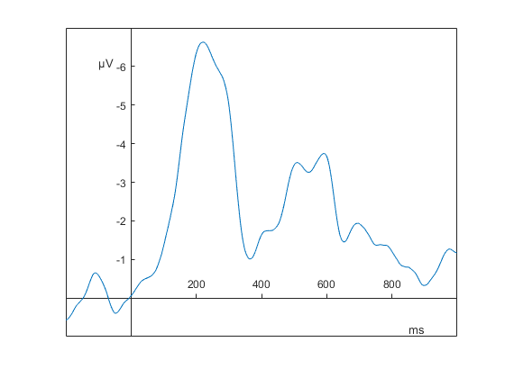

# Discussion
Our newly proposed template matching algorithm displayed consistently good psychometric properties and showed an improved ability to replicate human extraction behavior over previously established approaches like peak latency or area latency algorithms. Manual extraction has so far proven superior to algorithmic approaches [@sadus2023multiverse] but presents a time- and resource-intensive process. Our algorithm based on minimizing the weighted squared distance between transformed template and signal (MINSQ) correlated to $\overline{r} =$ `r mean_manualcor_overall %>% filter(method2_approach == "minsq", method2_review == "manual") %>% pull(mean) %>% apa_num(gt1 = FALSE)` with manually extracted ERP latencies across tasks and preprocessing steps. This indicates that the new algorithm was able to replicate manual extraction almost perfectly while presenting a more objective and efficient approach to latency extraction. **Hier Satz zu optimaler Methode / Filter ** Application of my algorithm would increase both replicability and scalability as well as significantly reduce the time and resources researchers need to spend on latency extraction. 

Because previous algorithms have been proposed, I considered it key to compare the effectiveness of my new algorithm against already established, potentially simpler algorithms.

## Reliability
Regarding the reliability of extracted latencies across tasks and preprocessing steps, my algorithm did not prove superior to the area latency approach. Both the MINSQ and MAXCOR approaches led to slightly lower Spearman-Brown corrected split-half correlations than in area latency approaches. However, the differences in reliability are quite small and only carry low practical implications. If the researcher uses latent-variable approaches in their analysis of ERP latencies like structural equation modelling, the error variance may be controlled and resulting latent variables may be considered free of measurement error [@bollen1989structural]. Especially in this case, slightly lower reliabilities carry negligible practical implications.

** take notes about what interests you in the table **
- with 0.8 threshold, only area latency consistently good
- Minsq seems better than maxcor
- with medium measurement window, minsq and maxcor lead to only very few cases where rel < 0.8

As Table \@ref(tab:tab-mean-reliability-flanker) illustrates, almost all extraction methods showed reliability estimates greater than $0.8$ in the Flanker task. In the Nback and Switching data, only the area latency algorithm continued to consistenlty show large reliability estimates. The MINSQ and MAXCOR algorithm showed their highest reliability estimates when using a medium measurement window.

## Homogeneity
Latency values extracted by the MINSQ algorithm proved to have the highest average correlation with all other extraction methods across tasks and preprocessing steps ($\overline{r_{h}} =$ `r mean_homogeneity_overall %>% filter(method1_approach == "minsq", method1_review == "manual") %>% pull(mean) %>% apa_num(gt1 = FALSE)`). This indicates that this approach best reflects the total of all other measures. The MAXCOR algorithm also proved superior to previously established extraction methods.

- Minsq best, most values are greater 0.8
- this is especially true for medium measurement window, where minsq and maxcor both show consistently good homogeneities for all tasks and filter settings

## Validity
@sadus2023multiverse showed that manually extracting latency values is the best approach to ensure good psychometric properties and high power to detect experimental effects. The ability of an algorithm to extract latency values correlating highly with those extracted by an expert ERP researcher was therefore of high importance to us. 
Again, the newly proposed algorithm proved to have a superior ability to replicate human behavior compared to previous approaches. The MINSQ algorithm, after manual inspection, had a mean intraclass correlation of $\overline{r} =$ `r mean_manualcor_overall %>% filter(method2_approach == "minsq", method2_review == "manual") %>% pull(mean) %>% apa_num(gt1 = FALSE, digits = 2)` with manually extracted latencies across tasks and preprocessing steps.

The MAXCOR algorithm also outperformed previously established approaches in the ability to replicate human behavior, correlating very highly with manually extracted latencies ($\overline{r} =$ `r mean_manualcor_overall %>% filter(method2_approach == "corr", method2_review == "manual") %>% pull(mean) %>% apa_num(gt1 = FALSE)`). Area latency measures also correlate highly with manually extracted data ($\overline{r} =$ `r mean_manualcor_overall %>% filter(method2_approach == "uninformed", method2_review == "none", method2_type == "autoarea") %>% pull(mean) %>% apa_num(gt1 = FALSE)`) but failed to match the performance of my new algorithm.

Importantly, even the fully automated pipelines of my algorithm that rejected those matches with fits $r_{st} \le .20$ led to mean intraclass correlations of $\overline{r} =$ `r mean_manualcor_overall %>% filter(method2_approach == "minsq", method2_review == "auto") %>% pull(mean) %>% apa_num(gt1 = FALSE)` for the MINSQ algorithm and $\overline{r} =$ `r mean_manualcor_overall %>% filter(method2_approach == "corr", method2_review == "auto") %>% pull(mean) %>% apa_num(gt1 = FALSE)` for the MAXCOR algorithm. This indicates that this new algorithm may be applied fully autonomously, eliminating the need for human intervention and increasing replicability and efficiency.

## **Discuss optimal filter setting and window here**

Any algorithmic approach to ERP latency extraction will be more objective than manually extracting ERP latencies. So I cannot crown any particular algorithm as more or less objective. The completely autonomous versions of peak latency, area latency or my algorithm with automatic rejection of bad fits are all equally objective. One strength of my approach is the ability for the researcher to inspect a subset of the ERPs based on the fit statistic of the matching procedure. This does introduce some subjectivity.

However, this ability of the algorithm to generate a fit statistic indicating the degree of certainty with which the match was made is a great strength of my new algorithm. Depending on the size of their data and the degree of certainty to which researchers want to manually inspect their data, one may choose any cut-off value for the fit statistic and inspect none, a subset or all of the ERPs and the choices made by the algorithm by hand. This feature is not present in any of the previous algorithms.

## Comparing MINSQ and MAXCOR
I chose to test out two different approaches to quantifying the degree of similarity between template and signal. One minimizing the weighted squared difference and one maximizing the correlation between the two. Both showed improvements over previous algorithms and I can recommend that both approaches be studied further. I did observe some differences between the two approaches in both procedural factors as well as outcome measures.

Procedurally, the largest difference between the two approaches is the optimization algorithm underlying them. Due to the invariance of the correlation of two vectors to scaling in amplitude of one vector, I can reduce the number of free parameters optimized during the MAXCOR approach to one. This allows me to use a more exhaustive optimization algorithm that will find the global optimum in some bounded parameter space without the possibility of converging on a local optimum. This is not the case for the multivariate optimization function needed for the MINSQ approach. Here, I initialize the optimization process at several different starting points and check for convergence on a common solution indicating that this solution represents the true global optimum. This is not ideal and could be improved in the future by implementing a more suitable optimization algorithm or improving on the one currently used.

The MINSQ algorithm may also converge on solutions where $a_j \le 0$ if the subject level signal is largely of a polarity opposite to that of the component of interest (see Figure \@ref(fig:only-negative-example)). Although I did extend the variability of the template by a parameter vertically shifting the template to account for these cases, sometimes even the extended version will converge on solutions with non-sensible parameter values. This leads to missing values and unreliable fit statistics in those cases. In my data, this happened for `r data_autoreview %>% filter(approach == "minsq", review == "none") %>% pull(freq) %>% print_percent` of all ERP signals analyzed by the algorithm. A large proportion of these cases may be considered unidentifiable even by an expert researcher due to particularly low signal-to-noise ratios. However, few cases where the component can be identified by a human researcher or the MAXCOR algorithm may be classified as missing by the MINSQ algorithm. I will implement additional measures aiming to reduce the number of cases where the MINSQ algorithm fails to converge on a valid solution in future work.

(ref:only-negative-example) Subject ERP with no positive-going signal
```{r only-negative-example, out.width = "75%", fig.cap = paste("(ref:only-negative-example)")}

```

This leads to the difference in the number of cases classified as missing by the MINSQ and MAXCOR approaches. While `r data_missing_review %>% filter(approach == "corr", review == "manual") %>% pull(freq) %>% print_percent()` of all cases were set to NA after manual inspection of the MAXCOR algorithm (`r data_missing_review %>% filter(approach == "corr", review == "auto") %>% pull(freq) %>% print_percent()` after automatic inspection), `r data_missing_review %>% filter(approach == "minsq", review == "manual") %>% pull(freq) %>% print_percent()` of all cases were set to NA in the MINSQ algorithm following inspection (`r data_missing_review %>% filter(approach == "minsq", review == "auto") %>% pull(freq) %>% print_percent()` after automatic inspection). This tradeoff between better properties of the MINSQ algorithm accompanied by more missing values must be taken into account when selecting which algorithm to use. Depending on the number of participants available and the means of analysis, missing values may be detrimental, leading to the MAXCOR algorithm being the preferable choice.

The weighting vector used in the MINSQ algorithm represents another difference between the two approaches. I used it to reflect the increased emphasis a human researcher places on those parts of the signal with the highest amplitude and signal appearing in the measurement window where the component of interest is expected to occur. The particular shape of the weighting function is somewhat arbitrary, but general aspects were chosen to reflect a few key considerations. For example, the maximum-normalization conducted before weights are calculated ensures that the weighting function is scale-invariant. Furthermore, I added larger weights to values inside the measurement window without completely discarding the impact of values outside the measurement window. I also chose to square the normalized amplitude in order to reflect a non-linear relationship between amplitude and importance. The exact shape of this weighting function may be argued and optimized further.

Regarding outcome measures, the MINSQ algorithm dominates the MAXCOR algorithm in almost all of the indices I inspected. It has better reliability, homogeneity, and validity. This provides evidence towards the argument that the MINSQ algorithm presents the better choice if one is limited to the application of just one algorithm.

## The impact of manual inspection
In order to choose a cut-off value for the fit statistic I tested different cut-off values and checked whether a large enough proportion of them proved problematic enough to merit manual inspection. I set $r_{st} \le .60$ as my cut-off because more conservative cut-offs led to a situation where a larger proportion of the matches I inspected had clearly correct results, where manual inspection was not necessary. Considering the size of my data and the number of ERPs I applied the algorithm to, I wanted to test whether efficient extraction of latencies using the new algorithm was possible even in the face of a large dataset. I inspected around `r data_manual_review %>% filter(approach == "corr") %>% pull(freq_reviewed) %>% unique() %>% print_percent()` of ERPs of the MAXCOR algorithm and `r data_manual_review %>% filter(approach == "minsq") %>% pull(freq_reviewed) %>% unique() %>% print_percent()` of ERPs in the MINSQ algorithm. Depending on how liberal or conservative the inspection is to be conducted, the cut-off value can be adjusted to increase or decrease the percentage of ERPs that have to be inspected manually.

This additional effort of manual inspection led to improved qualities of the extracted latencies over just automatically discarding fits with very bad fit statistics. Mean reliability and homogeneity improved and the values had slightly higher correlations with manually extracted latencies. However, the automatic rejection filter of $r_{st} \le .20$ was still able to extract latency values better than previously established algorithms and showed mean correlations with an expert researcher of $\overline{r} =$ `r mean_manualcor_overall %>% filter(method2_approach == "corr", method2_review == "auto") %>% pull(mean) %>% apa_num(gt1 = FALSE)` for the MAXCOR and $\overline{r} =$ `r mean_manualcor_overall %>% filter(method2_approach == "minsq", method2_review == "manual") %>% pull(mean) %>% apa_num(gt1 = FALSE)` for the MINSQ algorithm. 

Quantifying the certainty with which the template matching procedure chose a particular solution sets my algorithm apart from previous approaches. This enables the researcher to choose cut-off values for manual inspection and automatic rejection based on their particular needs in the current study. While more conservative inspection and rejection criteria will most likely improve the qualities of the extraction method, it also increases the time spent on inspection or the number of unidentifiable subject-level ERPs. This degree of control, especially using an objective criterion, is not available to researchers using other approaches. 

Recently, @luck2021standardized introduced the Standardized Measurement Error (SME) quantifying the quality of an individual's ERP data. This can be used to prune the dataset automatically, increasing the reliability of the latency values [@wascher2022mental]. Future work will investigate the benefit of incorporating the SME into my review process.

## Limitations
This template matching algorithm is limited by the type of transformation I employ to introduce variability that allow quantifying individual differences. For example, I chose not to implement a parameter shifting the entire template along the x-axis. Thus, latency can only be shifted by scaling the entire component. Transformation of location and shape of the component are confounded because later peaks necessitate broader components. This could be changed by introducing a parameter shifting the template without scaling it. However, this would also move the amplitude at 0 ms to some other time-point. As the origin is of special importance in ERP research, I decided against this shifting parameter. It is the only fix-point resulting from the averaging and baselining procedures. Thus, I chose not to disturb this property. Future work may investigate the impact the introduction of this additional parameter in template transformations has on the template matching algorithm. I also limited the algorithm to linear transformations of the template but could easily extend it to include non-linear scaling as well. Non-linear scaling would enable the template transformations to capture the effect of some participants not displaying speed differences in early components (low scaling), but showing slow late components (higher scaling). This helps disentangle transformations of location and transformations of shape without disturbing the origin of the signal.

<!-- I observed issues of the template matching algorithms for certain ERP-morphologies during manual inspection. They struggle especially with classifying subject-level ERPs containing two distinct peaks [See figure]. Both algorithms will return a match that may even fit quite well, but minor differences in the size of the two peaks can lead to inconsistencies across conditions. The algorithm may choose the first peak in one and the second peak in the other condition. This problem is not unique to my algorithm, other algorithms face the same challenge. Human researchers can inspect all different ERPs belonging to the same subject and introduce some stability into the extraction method. Algorithms don't typically allow for the use of information of a previous ERP in the extraction procedure of the current ERP. During manual inspection of the choices of my algorithm, this can be compensated for by the human researcher. -->

I only inspected one cut-off value for manual inspection and one for automatic rejection. These values were based on my experience in working with the algorithm, but this only provides limited insight into the impact of the cut-off value. Choosing a more conservative automatic rejection criterion may improve reliability and validity even further but come at a cost of a larger amount of missing values. 

The generalizability of my findings is limited by the data I analyzed here. I inspected a limited sample of participants, narrow range of tasks and only one ERP component. Depending on the component of interest, the effectiveness of different algorithms can vary [@kiesel2008measurement; @wascher2022mental]. I suspect that the effectiveness of all algorithms will decline when attempting to extract earlier components. The P3 is a broad, high-amplitude, and isolated component. This renders it ideal for algorithmic approaches, as the influence of surrounding components is comparatively low and the measurement window quite easily specified. Especially area latency approaches should diminish in quality due to the less isolated component structure of earlier components [@luck2014introduction]. I therefore expect that the benefits of my new algorithm relative to established algorithms will increase in earlier components.

## Future research
Future research should focus on applying template matching algorithms to earlier components. I also suggest simulating data, enabling future researchers to quantify the algorithm's ability to recover the true latency of a component. This present work serves largely as a proof-of-concept. The algorithm presented here has yet to prove itself in a larger variety of tasks, samples, and different ERP components.

I further suggest improving the optimization processes used during my algorithm. The function used to implement the optimization of the MINSQ does not consistently converge on the global optimum, which I compensated for by initializing five different starting points and testing the solutions for convergence. This could be improved upon further. Finding an analytical solution would be ideal, but exceeds the scope of this master thesis.

Currently, the algorithm aims to identify this global optimum representing the absolute best similarity between transformed template and signal. It may be advantageous to use a linear combination of the best percentile of transformations as the solution of the optimization process [@brunelli2009template; @brunelli1997template]. @brunelli2009template raised this issue in the context of multiclass pattern recognition. Correlation filters tend to result in broad peaks of optimality. I currently just choose the absolute peak and the algorithm returns the corresponding transformation parameters. Choosing the highest point in that peak is influenced by noise in the same manner as picking peaks of ERP components with peak latency algorithms. Future research should investigate a linear transformation like a weighted average when determining the optimal set of transformation parameters.

Aside from improvements in the implementation of the algorithm and extensions of the algorithm to earlier components, I will also improve the user interface employed for manual inspection. Currently, the interface displays the matched template and informs the researcher about the latency and fit statistic this match would yield. I also display the choices a peak latency and an area latency algorithm would have made. The researcher can then either accept the matched result, choose a result of the older algorithms, manually specify the component latency or reject the ERP overall due to poor identifiability. I will aim to improve this by adding a slider controlling the transformation parameters, allowing the researcher to manually match the template to the subject-level ERP. The functionality of manual latency specification will also be improved by integrating already existing software like the Measurement Tool provided by ERPLAB [@lopez2014erplab].

The particular cut-off values I chose for manual inspection or automatic rejection of the template matching solution allowed me to demonstrate both the algorithm's ability to extract ERP latencies completely automatically and the improvements gained from manually inspecting a subset of the choices the algorithm made. However, I did not quantify how different cut-off values would impact the number of ERPs inspected or rejected and the resulting quality of the extraction method. I will investigate this in further research, quantifying the impact of different cut-off values in order to gain insight into which cut-off values may be recommended depending on the context in which the algorithm is applied. 

# Conclusion
This work provides proof-of-concept showing that a template matching algorithm using the grand average as a template can be feasibly used to extract P3 latencies. Latencies extracted by this algorithm correlate highly with values extracted by an expert human researcher across tasks and preprocessing steps. The newly proposed algorithm is superior to previous algorithms like peak latency and area latency regarding the correlation with manually extracted latencies, and homogeneity. A main benefit of my approach is the ability to quantify the algorithm's confidence in a particular solution via a fit statistic. This allows researchers to inspect only the subset of ERPs with the worst fits and thus correct potential measurement error of the algorithm in a time-efficient manner. It also allows specification of a cut-off value for automatically rejecting template matches with bad fits, eliminating the need for human intervention. This fully automatic approach also displays qualities superior to previous algorithm. When comparing the two similarity measures, the MINSQ algorithm displays better qualities than the MAXCOR algorithm. However, it also results in a higher number of missing values. I will aim to improve the implementation of my algorithm and test the ability to extract earlier ERP components. Overall, the results obtained here leave me optimistic regarding the applicability of this template matching approach. It provides a more objective and efficient way to extract ERP latencies while maintaining consistently good psychometric quality and replicating decisions made by an expert human researcher.
