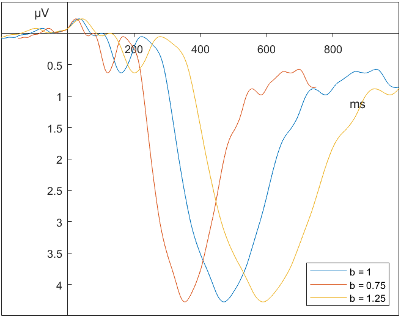

# Introduction
In cognitive neuroscience, the accurate extraction of latencies of event-related potentials (ERPs) stands as a crucial step in understanding the timing of neural processes that underlie cognitive functions [@posner2005timing; @meyer1988modern; @luck2014introduction]. Especially in studies focusing on individual differences an objective, efficient, valid, and reliable extraction process is paramount. Algorithms allow efficient and objective approaches to latency extraction, but often prove to be unreliable and invalid due to ERPs with low signal-to-noise ratios [@sadus2023multiverse; @schubert2023robust; @kiesel2008measurement; @clayson2013noise]. To deal with this issue, researchers often forgo the use of algorithms and manually inspect each ERP, identifying patterns reflecting the component of interest by hand [@sadus2023multiverse]. Manual extraction is a labor-intensive and time-consuming endeavor, improving reliability and validity at the cost of objectivity and efficiency. Low objectivity endangers replicability, it is therefore recommendable that all processing steps be automated [@rodrigues2021epos; @cowley2017computational]. This paper introduces a novel algorithm for the automatic extraction of ERP latencies using template matching. I aim to show that this new algorithm improves on existing approaches and enables more efficient, objective, reliable, and valid extraction of ERP latencies.

## Peak Latency Algorithms
Automatically extracting component latencies has long been a goal in ERP research. _Peak latency_ algorithms present the earliest attempt at automating the latency extraction process. The peak latency approach involves finding the point in time within a fixed measurement window that displays the largest voltage deflection in the appropriate direction. This approach remains the most common way of latency extraction [@kiesel2008measurement; @liesefeld2018estimating], partially due to its ease of implementation and low computational requirements [@donchin1978multivariate]. However, ease of implementation is accompanied by several drawbacks.

Firstly, peak latency approaches are blind to the general structure of the ERP signal. They locate the point in time with the largest voltage deflection within the measurement window. The "true" maximum signal may lay just outside of the measurement window, resulting in the algorithm picking an outside edge of the window, even though the signal increases in amplitude just following that time-point. The simple peak latency algorithm can be improved by only considering maxima inside the measurement window which are also larger than the surrounding data-points [@luck2014introduction]. A spike just on the edge of the measurement window will not meet these criteria. This approach protects against the influence of noise or surrounding components on the edges of the measurement window, but remains vulnerable to high frequency noise inducing peaks inside the measurement window. 

Due to high frequency noise, the maximum voltage deflection may not reflect the true point in time at which the process underlying the component reaches its maximum. Rather, the maximum voltage deflection may be the result of high frequency noise inducing a spike in the signal, independent of any cognitive process. This is problematic especially in later ERP components, as the broader measurement window most commonly applied increases the likelihood of high frequency noise inducing the maximum voltage deflection [@clayson2013noise].

The sensitivity of the peak latency approach to the size of the measurement window is further increased by the _superimposition problem_ [@luck2014introduction]. In larger measurement windows, later components can already influence the amplitude on the beginning and end of the signal in the measurement window. Researchers have to carefully choose the measurement window in order to include most of the signal related to the component of interest while simultaneously excluding influences of other components.

Lastly, as @luck2014introduction so aptly states: _There is nothing special about the point at which the voltage reaches a local maximum_. **ZITAT** The largest deflection does not inherently relate to any physiological or psychological process and may not even reflect the true maximum of the component of interest. @luck2005ten visually demonstrates how peak latency may be a result of the overlap of multiple components and not related to any single component.

## Fractional Area Latency Algorithms
_Fractional Area Latency_ approaches hope to remedy some of the problems associated with peak latency algorithms. This technique revolves around the area under the ERP signal in a given measurement window. The goal is to find the point in time that divides the area under the signal into a given fraction to the left and right of it. The time-point splitting the area under the signal in half, for example, is referred to as the _50% area latency_. This approach is much less susceptible to the influence of high frequency noise, as short spikes in the signal do not have a strong impact on the area under the signal [@liesefeld2018estimating]. Nonetheless, area latency approaches remain highly dependent on the measurement window [@luck2014introduction]. Choosing a shorter window may result in only a part of the area of the component of interest being captured. A wider measurement window, on the other hand, might include the influence of surrounding components. Fractional Area measures thus work best for investigating an isolated component [@luck2014introduction], limiting the applicability of area latency algorithms.

## Jackknifing
Another approach towards dealing with noisy subject-level ERPs is to try and mitigate that noise by averaging multiple subject-level ERPs. This technique is referred to as _jackknifing_ [@miller1998jackknife]. A total of $N - 1$ subject-level ERPs are averaged together, varying the subject-level signal that is left out to generate $N$ sub-grand averages. This averaging procedure results in $N$ ERPs with higher signal-to-noise ratios. Both _peak_ and _area_ based measures can then be applied to the jackknifed data to extract latencies. As any two jackknifed signals share $\frac{N-2}{N} * 100$ percent of the subject-level signals that are averaged with each other, each jackknifed sub-average is quite similar to all others. This artificially decreases the error variance, which needs to be corrected for when testing for differences between groups [@ulrich2001using]. Because latencies extracted from jackknifed ERPs are based on averaged waveforms, they can not readily be associated with any single subject, preventing this method from generating individual-level latency estimates needed for individual differences research. This problem was addressed by [@smulders2010simplifying] who introduced a transformation that is able to generate individual-level latency estimates.

## Comparison of Algorithms
@kiesel2008measurement applied these different algorithms, as well as a few additional approaches not mentioned here, to a variety of ERP components. They simulated latency differences of the visual and auditory N1, the N2pc, the P3, and frequency-related P3 and tested single-participant approaches and jackknife-approaches combined with peak latency, fractional area latency, relative criteria, and baseline deviation methods on their ability to detect these effects. The most widely used technique of single-participant approaches combined with peak latency extraction proved not to be the best method to detect latency effects. Its effectiveness decreases even further as the signal-to-noise ratio decreases. Overall, jackknifing ERPs and using the relative criterion technique or the fractional area latency technique was shown to be the best approach across the components and datasets they analyzed. 

This finding was further corroborated by @wascher2022mental, who investigated the ability of peak latency and area latency measures combined with jackknifing to generate reliable latency measures. Area latency measures combined with jackknifing generated the most reliable ERP latencies across a variety of components. However, even the best automated approach did not lead to consistently high reliabilities. 

Investigating this further, @sadus2023multiverse assessed the influence of different preprocessing strategies and latency extraction techniques on psychometric properties of the latency values as well as the ability to detect an age-related effect in P3 latency. They varied the strength of the low-pass filter applied to the data, used both single-participant and jackknife approaches and extracted latencies either automatically or manually, using either a peak latency or area latency approach. Both the size of the effect and the psychometric properties, such as reliability or homogeneity of the latency values, varied between the different analysis strategies. No combination of preprocessing steps and extraction method proved best across all tasks and groups and only 7 out of 40 possible pipelines showed consistently desirable reliabilities ($r_{tt} \ge .70$), homogeneities ($r_{h} \ge .50$), and effect sizes ($.03 \le \omega^2 <.80$). All of those seven pipelines used manual extraction methods either based on peak or area latencies. 

While automated extraction methods would improve both efficiency and objectivity, fully automated approaches failed to generate consistently reliable and valid latency measures [@wascher2022mental; @sadus2023multiverse; @schubert2023robust]. Yet, manual extraction methods are highly time-consuming and impede reproducibility. I hope to show that my algorithm can match the performance of manual extraction while providing a more efficient and objective approach for extracting individual component latency values.

## Template Matching
The algorithm proposed in this master thesis aims to resemble the process expert ERP researches employ during manual latency extraction. Most ERP researchers use the grand average to gather insight into what the component of interest _should_ look like and where it _should_ generally appear. When visually inspecting ERP signals, their goal is to identify a pattern within the signal that resembles the component of interest in shape, size, and location.

Finding a given pattern inside a noisy signal is not a novel task. Algorithms aiming to detect the appearance of a pattern, a _template_, inside audio-, video-, or radio signals have been around for over 50 years, and a large amount of research has gone into optimizing these _template matching_ algorithms [@brunelli2009template; @mahalakshmi2012image; @lewis1995fast; @briechle2001template].

No matter what the implementation details of a particular template matching algorithm are, they all aim to answer the question "Does this (smaller) template appear in my (larger) signal?". To achieve this, a researcher needs to specify two things. First, a template they want to search the signal for and second, a _similarity measure_ which quantifies how well the template fits in a given spot of the signal.

### Similarity measures
Specifying the template is mostly a substantive question depending on the specific task and type of signal. Choosing a similarity measure on the other hand is much more methodological. Across a number of papers, several different similarity measures have been proposed. They follow one of two general lines of thought [@brunelli1997template; @goshtasby1984two]. The first type of similarity measure aims to minimize some value reflecting the distance between template and the signal. The second type aims to maximize some form of correlation between signal and template. I have chosen to implement the algorithm based one of each of the two of the possible types, one minimizing the sum of squared differences and one maximizing the correlation between the template and the signal. I wanted to implement both a similarity measure following a traditional distance-minimization approach and a correlation-based approach in order to gauge the efficacy of these approaches when applied to ERP research. I call the algorithm based on minimization of the squared differences _MINSQ_ and the algorithm based on maximization of the correlation _MAXCOR_.

### Template generation
Depending on the field of study, the template to search for is easily specified. If you are looking to extract a particular audio-signal from a recording or some specific object in an image you can easily use that object as a template. The difficulty increases if it is not exactly certain what template you are looking for and what shape the template may take depending on various external factors. Recent research in image processing has attempted to use template matching to process faces [@brunelli2009template]. You cannot just use "the ideal set of eyes" to identify a face. Each person comes with their own set of eyes, different from all others in some quantifiable way. A similar issue accompanies attempts of template matching approaches in ERP research. The variance in ERP signals introduced by the task or the sample of participants hinders a successful implementation of template matching algorithms using only one idealized template over all types of studies. Finding a template that reflects the influence of the task or the sample, equivalent to finding the person who's eyes you are looking for, will significantly improve performance. 

## Prior template matching algorithms
There have been some attempts at using an idealized signal structure as a template to identify ocular artifacts in noisy subject-level data [@li2006automatic] or to predict subject behavior on a single-trial level [@william2020erp]. These studies were able to successfully implement template matching algorithms. However, they were not concerned with estimating the timing of components, but rather only interested in detection of a specific signal.

@borst2015discovery and @anderson2016discovery developed a machine-learning approach that aims to discover cognitive processing stages on a single-trial level. In a first step, their algorithm makes use of multivariate pattern analysis to detect "bumps" in the EEG signal representing the onset of a new cognitive state. They assumed that entry into a new state would be accompanied by a "bump" in the signal of all electrodes similar to a 50 ms half-sine. This 50 ms half-sine then serves as a template with which their algorithm tries to detect those "bumps" in activity. However, their assumptions regarding the template and the location of activity are somewhat crude generalizations made necessary by noisy single trial data. Using template matching to extract component latencies from ERPs requires a more informative template than a half-sine. 

## Using the grand average as a template
A simple approach towards designing a more informative template would be to generate an idealized component structure. Prior knowledge about the shape, size, and location about the component of interest could then used. One could draw up "the perfect P3" and attempt to use this as a template. However, this neglects the experiment-specific, task-specific, and sample-specific variance in the morphology of ERP components, resulting in a template that does not optimally reflect the data. I addressed this problem by using the grand average as an experiment-specific template of the component of interest that. The grand average reflects influences of the task and sample on the morphology of the idealized ERP component while retaining a high signal-to-noise ratio. 

This makes grand average is a prime candidate for an experiment-specific template. It is by definition the average of all subject-level ERPs and thus minimizes the sum of squared deviations between each subject-level ERP and itself. Thus, across all subjects, it is the best approximation, i.e. the best predictor, for each subject-level ERP. Using the grand average to gain insight into subject-level ERPs is already quite common, researchers often use the grand average to gather insight into the time window in which the component of interest occurs [@kiesel2008measurement; @luck2014introduction].

Importantly, the goal of this algorithm is to quantify individual differences in the latency of ERP components, not only the presence of a particular ERP component. This is similar to facial recognition not only detecting the presence of eyes, but also determining the person the eyes belong to. The algorithm does not only aim to detect the presence of a component, but also aims to measure individual differences in shape, size, and location of the component.

Due to these individual differences, there may be a mismatch between a particular subject-level ERP and the grand average. A specific signal may have higher amplitudes than the grand average or the component may appear earlier. Quantifying this deviance of a particular subject-level ERP from the grand average in amplitude and time-course is precisely the goal of this algorithm.

To measure the deviation in amplitude and time-course, I introduce free parameters that transform the template in its amplitude and time-course. Because of this transformation, the algorithm does not attempt to match any specific, static template. Rather, it attempts to match a variable template and then determines which transformation fits the particular subject-level ERP best. Crudely, each version of the variable template reflects the idealized template that I obtained using the grand average if it had higher vs. lower overall amplitudes and earlier vs. later latencies of the component of interest. Determining which transformation of the template fits to the subject-level ERP best then allows the algorithm to quantify the deviation in amplitude and time-course of a specific subject-level ERP in relation to the grand average.

## Mapping individual differences
I restricted the variability in the template to linear transformations only for this master thesis. This was done in an effort to limit the complexity and increase the traceability of the algorithm. One key characteristic of ERP signals is that the signal at $0\ ms$ is always equal to 0. I chose to restrict the algorithm to transformations of the template that do not disturb this property. Horizontal "shifts" of the template's signal, for example, would lead to non-zero signal at $0\ ms$. Therefore, the algorithm is not allowed to introduce variability into the template through horizontal shifts. For this master thesis, I only allowed two transformations, controlled by one free parameter each.

Variability in amplitude is controlled by the transformation parameter $a$, variability in latency by the parameter $b$. Amplitude of the template is varied by multiplying the whole template-signal by parameter $a$. Latency is varied by "stretching" or "compressing" the template along the x-axis (see Figure \@ref(fig:b-scale-example)). Importantly, this does not "shift" the signal, which would lead to a non-zero signal at the origin. The parameter $b$ controls the strength of this transformation. Possible transformations of the template are then compared to the signal and their similarity is evaluated. Recovering the transformation parameters $[a, b]$ that lead to the best match between template and signal thus allows me to describe individual differences in the latency of a component. Whereas the matching procedure is based on the entire template, I can also apply the transformation parameters to a specific time-point. Researchers can extract subject-level component latencies by specifying a time-point of the grand average denoting the latency of the component of interest. The optimal transformation parameters are then applied to the grand average latency and result in the subject-level latency of the component.

(ref:b-scale-example) Scaling Templates Horizontally
```{r b-scale-example, out.width = "75%", fig.cap = paste("(ref:b-scale-example)")}

```

## Measurement windows
The two key ingredients for template matching are present. I use the grand average to construct a variable template that is then matched to a particular subject-level ERP by optimizing either the distance-criterion _MINSQ_ or the correlation-criterion _MAXCOR_. However, during manual inspection of ERP signals, not all signal is considered equal. Depending on the component of interest, different points in time of the signal become more or less relevant. When an early component, e.g. the P1, is the target, the activity after 600ms becomes less relevant. Similarly, when a late component is of interest, early activity becomes less relevant than activity at those times where the component typically occurs.

This can be reflected in the algorithm. I can supply a time window that specifies where signal of the template is more important. This should be constructed based on visual inspection of the grand average. If a late component, like the P3, is the target and the grand average shows that the activity of this component occurs mostly between 200 - 700 ms, the algorithm can take that information into account by weighting the similarity measure during that time with a higher weight than signal that lies outside of 200 - 700 ms.

## Why the algorithm may perform better
This algorithm aims to address some of the issues faced by other algorithms. It makes use of the entire component structure to construct the template that is matched to subject-level ERPs. This reflects the decision process of expert ERP researchers and enables an intuitive understanding of the decisions made by the algorithm. Because the similarity measures take the whole component structure into account, they are robust to peaks introduced by high frequency noise. Furthermore, the measurement window set by the researcher only impacts the size and shape of the template. It has no direct connection to the subject-level ERP. The influence of measurement windows on the extracted latencies should thus be lower than in peak latency or area latency algorithms. Lastly, it is important to note that this is not a machine learning algorithm with a neural net representing some "black box" decision making algorithm. Simplicity and traceability of the decision process was an important goal, allowing more insight into the benefits and drawbacks of the algorithm.

## The present study
In order to compare the quality of my proposed algorithm with the quality of previously proposed algorithms, I will reanalyze the same data analyzed by @sadus2023multiverse. I compare the psychometric properties of the algorithm to those of previously established algorithms, investigate the impact of different preprocessing steps, and evaluate the correlation between latencies extracted by my algorithm and those extracted manually by an expert ERP researcher.

In their study, @sadus2023multiverse extracted latencies of the P3b component, henceforth simply referred to as P3. The P3 is a centro-parietal positive-going component, peaking around 300 ms after stimulus onset. It is often associated with higher-order cognitive processes [@duncan1981young; @donchin1981surprise; @verleger2020effects; @polich2007updating; @polich2012neuropsychology; @mccarthy1981metric]. A number of studies have demonstrated a large effect of age on the latency of the P3 across a number of tasks with older participants displaying systematically later P3 peaks than their younger counterparts [@friedman2012components; @scrivano2022behavioral]. In a multiverse approach @sadus2023multiverse tested several extraction methods with varying preprocessing steps in their ability to detect this age effect. They also used three tasks, each measuring one of the executive functions proposed by @miyake2000unity. To measure the functions _updating_, _shifting_, and _inhibition_, they employed an Nback, a Switching, and a Flanker Task, respectively. Studying three different tasks allows insight into a larger variety of higher-order cognitive processing, improving the generalizability of my findings. 

For the present work, I will restrict the analysis to extracting P3 latencies, as the P3 usually has a broad and isolated structure with comparatively low influence of surrounding components [@luck2014introduction]. This makes the it one of the easier components to extract using automated latency extraction approaches. After I can demonstrate proof-of-concept for P3 latency extraction, I will evaluate whether I can apply the algorithm ability to other ERP components.

To investigate the impact of choices made by the researcher during preprocessing and analysis, I will vary preprocessing steps and the measurement window used during template matching. This will allow me to gain insight into which combination of preprocessing steps and size of measurement window leads to most optimal results.

I hope to show that a template matching approach using the grand average as a variable template can successfully extract subject-level P3 component latencies. Ideally, use of this algorithm will improve psychometric properties in comparison to prior algorithms, show high correlations with manually extracted data and present an objective and efficient way to extract ERP latencies.
