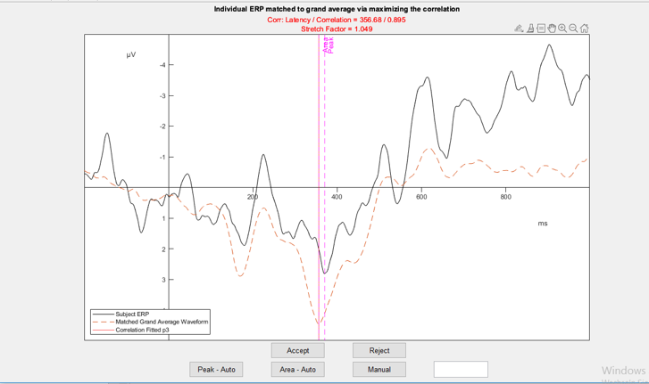

# Implementation
I implemented the algorithm in MATLAB (Version 2022b) [@matlab2022b]. The user of the algorithm needs to specify the name and polarity of the component of interest and importantly, the measurement window. This window is used to extract the template. In order to transform the template, I use MATLABs Curve Fitting Toolbox [@matlab2022b] to generate _sum of sines_ functions that fit to the data with $R^2 \ge 0.999$. I then add an amplitude parameter $a$ to the overall function in order to allow for scaling of the amplitude of the template and a frequency parameter $b$ to all frequency terms in the sum of sines function to allow for "squishing" or "stretching" the template along the x-Axis. The resulting variable template is described by a function $f(x, a, b)$ with $n$ sine terms and their respective amplitude $A_i$, frequency $f_i$ and phase $\phi_i$.

$$f(x, a, b) = a\sum_{i = 1}^{n} A_isin(bf_ix + \phi_i.$$
As these transformations also change the measurement window, I chose to use the subject-level ERP as a template and keep the grand average untransformed as a signal. This reverse matching approach is only an implementation detail and does not affect any decisions made by the algorithm.

Depending on the similarity measure, I use different functions to find the set of optimal parameters $[a_j, b_j]$ that lead to the optimal transformation for a given subject $j$. 

## MINSQ
The MINSQ algorithm minimizes the weighted sum $S$ of squared differences $d$ between the transformed subject signal and the grand average. 
$$S = \sum_{i = 1}^{n}\omega_{i}d_{i}^2.$$
The weighting vector $\omega$ that we use to place emphasis on those time-points of the signal specified by the researcher beforehand is computed as follows:
$$\omega_i = 1+\mathbb{1}_{[t_{start}, t_{end}]}(x_i)(10 \cdot |\frac{y_i}{y_{max}}|)^2,$$
where 
$$\mathbb{1}_{[t_{start}, t_{end}]}(x_i) = \begin{cases} 1, & \text{if $t_{start} \le x_i \le t_{end}$} \\ 0, & \text{otherwise}\end{cases}.$$
$[t_{start}, t_{end}]$ denotes the measurement window, $y_{i}$ the signal strength of the $i$th element, $y_{max}$ the maximum voltage deflection inside the measurement window and $x_i$ the time of the $i$th element.

The resulting weighting vector $\omega$ places more emphasis on fitting the template within the specified measurement window and to places in the signal where the voltage deflection is high. 

I use MATLABs _fit_ function to find optimal parameters $[a_j, b_j]$ with upper and lower bounds such that $a_j \in [0, 50]; b_j \in [0.5, 3]$. As this function may be prone to converging on local minima, I initialize 5 different start points. The algorithm selects the solution with the best correlation between transformed template and signal that multiple start points converged on is selected.

In cases where the subject-level ERP only has signal with deflections opposite of the deflection of the component of interest, it may occur that the parameter $a_j \le 0$. In these cases, I attempt to re-match the signal with an added parameter $d$ shifting the entire template up or down. 
$$f(x, a,b, d) = d +a\sum_{i = 1}^{n} A_isin(b*f_ix + \phi_i).$$ 
Should the algorithm again converge on a solution with $a_j \le 0$, the latency value is set to NA.

## MAXCOR
The MAXCOR algorithm optimizes the parameters to produce the maximum correlation $r_{st}$ between the transformed subject-level signal $s$ and the grand average $t$ for values in the measurement window. Time-points outside the measurement window are not allowed to influence the correlation.
$$r_{st} = \frac{\sum(s_i - \bar{s})(t_{i} - \bar{t})}{\sqrt{\sum(s_i - \bar{s})^2(t_{i} - \bar{t})^2}}.$$
$t$ represents the vector of values of the transformed subject ERP that are in the measurement window, $s$ the vector of values of the grand average that are in the measurement window. As the correlation-coefficient is independent of translation and scaling, varying the parameter $a_j$ will not impact the correlation $r_{st}$. I therefore set $a_j = 1$ and only optimize $b_j$.

Because I only need to optimize one parameter, I use MATLABs _fminbnd_ function to find the optimal transformation parameter $b_j$ maximizing $r_{st}$. This function will estimate the correlation for all values inside the given bounds $b_j \in [0.5, 2]$ and converge on the global optimum. Hence, I do not need to initialize a number of different starting points here.

### Recovering subject-level latencies
For both approaches, I use the returned value of the parameter $b_j$ to transform the component latency specified by the researcher in the grand average $l_{GA}$ to the component latency of the subject-level ERP signal $l_j$. 
$$ l_j = l_{GA} * b_j.$$

## Review methods
Researchers can manually review all choices the algorithm has made in a custom-built user interface (see Figure \@ref(fig:review-gui-example)). For both approaches, I used the correlation between transformed template and signal as a fit-index. I chose to use the correlation as the final fit-index as it is scale-invariant and provides an intuitive understanding of how strongly the structure of the matched template resembles the structure of the subject-level ERP.  The fit index can be used to only review those cases where the correlation between template and signal dips below a certain value, indicating low similarity between matched template and signal. I will investigate the additional benefits that a manual review process provides over accepting the choices as-is or only automatically discarding those matches with correlations $r_{st} \le .20$.

(ref:review-gui-example) User Interface for Manual Review Process
```{r review-gui-example, out.width="75%", fig.cap=paste("(ref:review-gui-example)")}

```


# Method
The following analyses are based on data that were first published by @sadus2023multiverse and are a subset of the data collected by @loffler2022common.

## Participants
The present sample consists of 30 young participants (18-21 years old, mean age = 19.37, SD age = 0.76) and 30 old participants (50-60 years old, mean age = 55.83, SD age = 2.87) representing the 30 youngest and 30 oldest participants from the overall study [@loffler2022common]. All participants had normal or corrected to normal vision. None of the participants had neurological or mental disorders, used psychotropic drugs, wore a pacemaker or suffered from red-green color vision deficiency. The participants provided informed consent prior to participation and received 75€ or course credit for participation.

## Tasks
All participants completed a set of 3 tasks: a Flanker Task, an Nback Task, and a Switching Task. Each task measures one of the executive functions proposed by @miyake2000unity. @loffler2022common programmed all tasks in MATLAB [@matlab2022b] using the software package Psychtoolbox (Version 3-0.13) [@kleiner2007psychtoolbox; @pelli1997videotoolbox; @brainard1997psychophysics]. Stimuli were presented centrally on a black background. I instructed participants to respond as quickly and accurately as possible.

### Flanker Task
@loffler2022common administered a standard Arrow Flanker task [@eriksen1974effects] to measure participants' _inhibition_ ability. A central arrow pointing either to the left or to the right is flanked by two additional arrows to each side. These flanking arrows either point in the same or in the opposite direction as the central arrow. All participants have to indicate by button press in which direction the central arrow pointed, disregarding the congruent or incongruent flanking arrows. All participants completed a set of practice trials and a total of 100 congruent and 100 incongruent trials.

### Nback Task
@loffler2022common administered an adapted version of the Nback task from [@scharinger2015flanker] to measure participants' _updating_ abilities. A stream of letters is presented. In the 0-back condition, participants have to indicate by keypress whether the presented letter is equivalent to a target letter. In the 1-back condition, participants have to indicate whether the currently presented letter is the same as the letter presented one trial before or not. @loffler2022common also had participants complete a 2-back condition. I excluded this condition from the analysis as it did not produce clear ERPs. In total, all participants completed a set of practice trials and 96 trials per condition.

### Switching Task
@loffler2022common administered a Switching task to measure participants' _shifting_ ability. A stream of colored digits ranging from 1 to 9 was presented. All participants had to indicate whether the digit was greater than or less than 5 or whether the digit was odd or even depending on the color of the stimulus. A colored fixation cross just prior to stimulus presentation cued the rule participants had to follow in the upcoming trial. Participants had to either follow the same rule as in the trial before or switch to the other rule. Participants completed a set of practice trials and 192 trials each in the repeat and in the switch condition.

## Procedure
The original study consisted of three test sessions. The three tasks analyzed here were all administered in the first session. The second session also included EEG measurement with 3 additional tasks. The third session was used to measure intelligence and working memory capacity. No EEG measurements were taken here. In sessions including EEG measurements, participants were seated approximately 140cm away from a monitor in a sound-attenuated room.

## EEG recording and processing
EEG was recorded continuously using 32 equidistant Ag/AgCl electrodes. Additional electrooculogram (EOG) measures were taken by two electrode placed above and below the left eye to correct for ocular artifacts. All impedances were kept below 5 kΩ. The signal was recorded with a sampling rate of 1000 Hz and online-referenced to Cz. To remove artifacts, I conducted an ICA on a cloned version of the dataset down-sampled to 200 Hz and passed through an additional high-pass filter of 1 Hz. Both the original data as well as the ICA-dataset were cleaned by removing line-noise using the CleanLine function [@mullen2012cleanline]. I also applied z-value based bad channels detection with a critical z-value of 3.29 as recommended in the EPOS pipeline [@rodrigues2021epos]. Channels that were removed following this procedure were interpolated and the data was re-referenced to the average across electrodes. I set $1000 \ \mu V$ as the threshold for large fluctuations and data had to be more than 5 SDs from the mean to exceed the probability threshold. Based on these settings, I automatically detected segments containing artifacts and removed those in the ICA-dataset up to a maximum of 5% of segments per iteration. ICA was conducted using the InfoMax algorithm and the resulting decomposition applied to the original dataset. ICs were labelled using the ICLabel Algorithm [@pion2019iclabel] and removed if the IC was less than 50% likely to be brain activity. I then applied Butterworth low-pass filters with varying cut-off frequencies (8 Hz, 16 Hz, 32 Hz) and a roll-off of 12 dB/octave. Data was segmented into 1200ms long segments starting 200ms before stimulus onset. Segments containing artifacts were automatically detected and removed. As a last step, I conducted a baseline correction using the 200ms prior to stimulus onset.

## ERP analysis
ERP analyses were conducted in MATLAB (Version 2022b) [@matlab2022b]. I only included correct trials into the analysis. I investigated the P3 at the electrode Pz [@polich2012neuropsychology; @verleger2020effects].

### Latency extraction
To evaluate the impact of the specified measurement window, I extracted latencies three separate times using either a narrow (250-600ms), medium (200-700ms) or wide (150-900ms) measurement window. I used the peak latency approach to determine the latency of the P3 in the grand averages that is then used to recover subject-level latencies in the template matching algorithm. I applied my algorithm using both the distance-based (MINSQ) and correlation-based (MAXCOR) similarity measures to the data and obtained transformation parameters and fit values.

To investigate the benefits of manually reviewing the decisions of the algorithm, I chose to review all matches that resulted in fit values $r_{st} \le .60$. I then inspected the subject-level ERP with the matched template superimposed on the subject-level ERP to allow visual confirmation of the fit. Using the interface I either accepted, rejected or manually determined the P3 peak latency of these ERPs. I also explored the impact of automatically excluding all those matches with fit values $r_{st} \le .20$.

In the present dataset, each of the 60 participants contributed 6 ERPs per task to the data. All participants contributed one ERP averaged over all trials of each of the two conditions and two more ERPs that were generated by an odd-even split on a trial level of that condition. These 360 ERPs each from the 3 different tasks were passed through 3 different low-pass filters and subjected to analyses with 3 separate measurement windows. I applied both the correlation-based (MAXCOR) and distance-based (MINSQ) algorithm and either reviewed the results manually, discarded bad matches automatically or accepted the results regardless of fit. I also applied both a peak latency and 50% area latency algorithm. For the area latency algorithm, I set all values below zero to be equal to zero to combat low frequency noise [@liesefeld2018estimating; @luck2014introduction] and determined the exact latency by linear interpolation between data points. This results in 3 tasks $\times$ 3 filters $\times$ 3 windows $\times$ $(3 + 3 + 2)$ algorithms = 216 different extraction pipelines.

## Validation Techniques
I investigated the impact of latency extraction method on several measures of psychometric quality. I estimated reliability $r_{tt}$ by computing Spearman-Brown corrected split-half correlations of ERPs generated from an odd-even split at the trial level. I assessed the validity of my algorithm through measures of homogeneity, the effect sizes of the age effect, and the intraclass correlation of latencies extracted by the algorithm with latencies extracted by an expert ERP researcher, which constitute a benchmark for proper latency extraction [@sadus2023multiverse]. The intraclass correlation used a two-way random-effects model focusing on absolute agreement.

To compute a methods homogeneity $r_h$, I calculated the correlation of latencies that were extracted using that method with all other methods and took the mean of the Fisher-Z transformed correlation coefficients. Correlation coefficients of 1 cannot be transformed. Thus, I set all correlations $r = 1.00$ to $r = .99$. The mean correlation with other methods indicates the extent to which a particular method reflects the total of all other measures [@kline1986handbook].

To investigate the effect of age on P3 latencies, I ran a repeated measures ANOVA with the between factor age (young vs. old) and the within factor task (Flanker, Nback, Switching).

I quantified the extent to which an extraction method is able to replicate the benchmark of manual extraction by computing the intraclass correlation between the latencies extracted by a particular method with those extracted by an expert researcher in the same task and filter condition.
